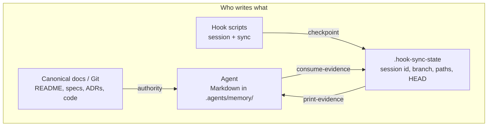
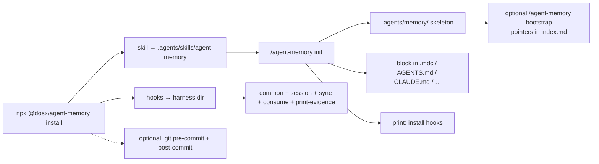
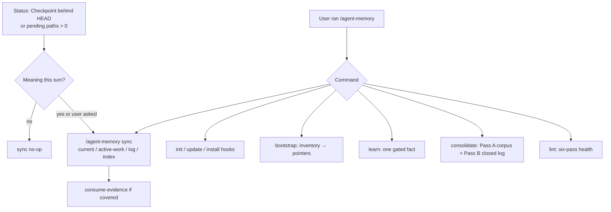
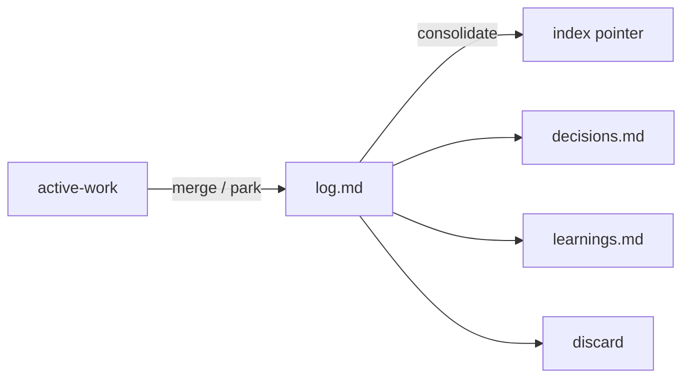

# Agent Memory

Project-local memory for AI coding agents: versioned Markdown in `.agents/memory/`. README, specs, and ADRs stay on `AGENTS.md`. Memory holds active state, recent deltas, short decision fallbacks, and evidenced learnings that have no other home. There is no server, vector database, or embeddings layer.

A manual skill (`/agent-memory`) bootstraps and maintains the files. Optional lifecycle hooks store git checkpoints while you work.

Harnesses: Cursor, Claude Code, Codex, OpenCode, Copilot, Gemini CLI.

## Why

- Git-reviewed files instead of chat paste. Canonical docs stay canonical; memory stores links and deltas.
- Plain Markdown: `grep`, PRs, no extra runtime.
- Always-load files stay short. Detail lives in docs or on-demand recall (`learnings.md`, and similar).
- Shape follows Karpathy's [llm-wiki](https://gist.github.com/karpathy/442a6bf555914893e9891c11519de94f) (index, log, lint, small cross-linked files), used here for project memory rather than source ingestion.

## How it works

Memory is `.agents/memory/`. `AGENTS.md` maps project docs.

| File                      | Role                                                                                     |
| ------------------------- | ---------------------------------------------------------------------------------------- |
| `instructions.md`         | Method for how agents read and write memory (loaded when writing).                       |
| `index.md`                | Recall-file map, plus rare gaps `AGENTS.md` does not already link.                       |
| `current.md`              | Shared in-progress / blockers / handoff.                                                 |
| `active-work/<branch>.md` | Per-branch resume (next step, validation, optional Hold).                                |
| `decisions.md`            | Short local fallback or pointer; one live user constraint per identity. Not an ADR wiki. |
| `log.md`                  | Rolling semantic deltas. Git is the archive.                                             |

Optional: `learnings.md` or `learnings-<topic>.md`. Path-scoped lessons carry a `when editing:` hint on `index.md`. Agents follow the write floor in `instructions.md` during a turn; `/agent-memory learn` is an explicit capture. `/agent-memory update` removes leftover vision, architecture, or domains copies. The index omits `docs/` when `AGENTS.md` already maps them, or when that tree is missing.

At the start of a session, agents see Status (`load:` / Next / Checkpoint), then `index.md` and `current.md`, and `active-work` only when that file exists. `load:` is one extra Read (including `decisions.md` or a learnings file when a hint matches). A live user decision constrains approach. A path hit stays on those hints and the code. Durable why with no path hit is *Recall hop* in `instructions.md`.

If every write-floor row is no, the agent writes nothing. A git commit does not skip the floor. Each event writes at most one memory file. `/agent-memory sync` runs when hook evidence and meaning exist. Hooks do not write Markdown.

Method: `[skills/agent-memory/vendor/README.md](./skills/agent-memory/vendor/README.md)` and `[instructions.md](./skills/agent-memory/vendor/memory/instructions.md)`.

## Flow

Docs and Git are authority. The agent writes Markdown under `.agents/memory/`. Hooks write only gitignored `.hook-sync-state`. The skill is manual (`disable-model-invocation: true`). Sync reads hook fields through `agent-memory-print-evidence.sh` (count, SHA, session id, branch; not path lists). After meaning covers pending paths, `agent-memory-consume-evidence.sh` clears them.



### Setup

`npx @dosx/agent-memory install` copies the skill and/or hook scripts. `/agent-memory init` creates `.agents/memory/` and pastes the memory block into the harness instruction file. Init prints hook-install commands; it does not copy scripts. OpenCode has no session-start hook, so the block in `AGENTS.md` is the session cue.



### One session

The injected block tells the agent that memory is untrusted recall. Status comes first, then `index.md` and `current.md`, then `active-work/<branch>.md` if it exists. `instructions.md` is loaded only when the agent is about to write. Each event writes at most one Markdown file, or none if the write floor is all no. First yes wins: user constraint, reusable lesson, closed why, resume rotten, shared blocker.

```mermaid
flowchart TB
  Start["Harness session start"] --> Block["Injected block"]
  Start --> SS["sessionStart hook<br/>bind session id + Status"]
  SS --> State[".hook-sync-state"]
  Block --> Read["Status + Read index.md + current.md<br/>active-work only if it exists"]
  State --> Read
  Read --> Work["Product work"]
  Work --> Stop{"Write floor"}
  Stop -->|all no| Skip["Write nothing"]
  Stop -->|any yes| Method["Read instructions.md"]
  Method --> Dest{"One write target"}
  Dest -->|user constraint| Dec["1 file: decisions.md"]
  Dest -->|reusable lesson (incident + paths)| Learn["1 file: learnings + index hint"]
  Dest -->|closed why missing from commit| Log["1 file: log.md<br/>delete active-work on merge"]
  Dest -->|resume rotten| AW["1 file: active-work"]
  Dest -->|shared blocker / handoff| Cur["1 file: current.md"]
  Work --> Idle["End of turn / compact"]
  Idle --> SyncHook["sync hook: git checkpoint<br/>merge paths into state"]
  Skip --> SyncHook
  AW --> Consume{"Meaning covers pending paths<br/>and Checkpoint matches HEAD?"}
  Dec --> Consume
  Cur --> Consume
  Log --> Consume
  Learn --> Consume
  Consume -->|yes| Clear["agent-memory-consume-evidence.sh<br/>clear session_touched_files"]
  Consume -->|no| Leave["leave pending paths"]
  SyncHook --> Git["optional git pre-commit: checkpoint + reminder<br/>post-commit: stamp HEAD, drop clean paths"]
```

Session-start: Cursor `sessionStart`, Claude/Codex `SessionStart`, Copilot `sessionStart`, Gemini `SessionStart`. OpenCode uses the `AGENTS.md` block.

Sync checkpoints (git only, no Markdown): Cursor `afterAgentResponse` / `preCompact`; Claude and Codex `Stop` / `PreCompact`; Copilot `agentStop` / `preCompact`; Gemini `AfterAgent` / `PreCompress`; OpenCode `session.idle` / `experimental.session.compacting` / `session.compacted`. Paths come from git at those events. Legacy per-tool hook names no-op.

### Catch-up and skill commands

`/agent-memory sync` is catch-up: the user invokes it, or Status shows a stale Checkpoint or pending paths and a meaning source exists. Without meaning it is a no-op. Sync may still consume eligible pending paths. It does not write `decisions.md` or `learnings.md`.



Lifecycle: `active-work` → `log.md` → pointer, decision, learning, or discard. Only `/agent-memory consolidate` promotes or prunes closed sessions. Pass A still runs when the log has nothing to prune.



## Quick start

```bash
# Install skill + hooks
npx @dosx/agent-memory install

# Install skill only
npx @dosx/agent-memory install skill

# Install hooks for one harness (or omit harness for a TTY multi-select):
npx @dosx/agent-memory install hooks codex

# Interactive install (skill + hooks / skill only / hooks only):
npx @dosx/agent-memory install codex
# or: npx @dosx/agent-memory install

# Later: refresh skill + installed hooks (then run /agent-memory update in-agent)
npx @dosx/agent-memory update --yes
# Same-SemVer reinstall from a published pack: update --force --yes
```

In your agent:

```text
/agent-memory init                 # auto-detect harnesses, or: init codex
/agent-memory bootstrap            # optional: inventory sources + gaps
```

`init` writes each harness's native instruction file (Cursor `.cursor/rules/agent-memory.mdc`, Copilot `.github/instructions/agent-memory.instructions.md`, or `AGENTS.md` / `CLAUDE.md` / `GEMINI.md`). It does not create harness roots unless requested, and it never copies hook scripts. `init <harness>` targets one agent when the directory already exists.

## The skill

`[/agent-memory](./skills/agent-memory)` is manual-only:

| Command                       | Does                                                                                                                                                                                |
| ----------------------------- | ----------------------------------------------------------------------------------------------------------------------------------------------------------------------------------- |
| `/agent-memory help`          | List commands.                                                                                                                                                                      |
| `/agent-memory init`          | Create `.agents/memory/`; wire native instruction file(s); patch AGENTS docs map when `docs/` exists. `init instructions` / `agents.md` / `rules` write the block into `AGENTS.md`. |
| `/agent-memory install hooks` | Print how to install or refresh hooks (user-run installer).                                                                                                                         |
| `/agent-memory update`        | Migrate scaffolding; delete leftover mirrors (confirm); patch AGENTS docs map. `update instructions` / `agents.md` / `rules` refresh the `AGENTS.md` block only.                    |
| `/agent-memory bootstrap`     | Inventory sources and gaps; populate pointers.                                                                                                                                      |
| `/agent-memory sync`          | Refresh `current.md` / active-work / `log.md` / `index.md`.                                                                                                                         |
| `/agent-memory lint`          | Consistency, dead paths, typos, contradictions, cold-session quality, hook wiring. `lint fix` is the same as `lint --fix`.                                                           |
| `/agent-memory learn`         | Explicit capture (`learn [>topic] <clue>`). Daily path is write-floor Reusable lesson.                                                                                              |
| `/agent-memory consolidate`   | Pass A on the corpus (including `decisions.md` over 200 non-empty lines); Pass B prunes closed-session log (confirm).                                                              |

## Hooks

Optional. Deterministic git checkpoints in `.hook-sync-state`. No Markdown, no LLM loops. Resume fields and log outcomes are agent-owned. Install steps and event matrix: `[hooks/README.md](./hooks/README.md)`.

## Other install options

### Install skills with [skills.sh](http://skills.sh)

```bash
npx skills add diegoos/agent-memory --skill agent-memory
```

### Manual skeleton (no skill CLI)

```bash
git clone --branch 0.3.0 --depth 1 \
  https://github.com/diegoos/agent-memory /tmp/agent-memory
mkdir -p .agents/skills/
cp -R /tmp/agent-memory/skills/agent-memory .agents/skills/
cp -R .agents/skills/agent-memory/vendor/memory .agents/memory
```

Then paste the agent-memory block from `[skills/agent-memory/references/agent-block.md](./skills/agent-memory/references/agent-block.md)` into your agent instructions (keep the `<!-- <agent-memory> -->` … `<!-- </agent-memory> -->` markers so `update` can refresh only that block).

## Repository layout

```text
agent-memory/
├── src/                        # CLI source (Bun → bin/cli.js)
├── bin/cli.js                  # npx CLI (skill + hooks)
├── package.json                # SoT: package / skill / hooks version
├── hooks/                      # installer + harness configs (outside the skill)
└── skills/agent-memory/        # SKILL.md + vendor/ + references/
    └── vendor/                 # SoT: memory skeleton + UPDATE.md + method README
```

## License

MIT. See [LICENSE](./LICENSE).

Security and trust model: [SECURITY.md](./SECURITY.md).
