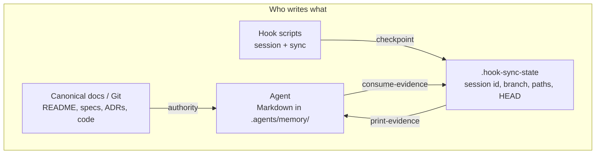
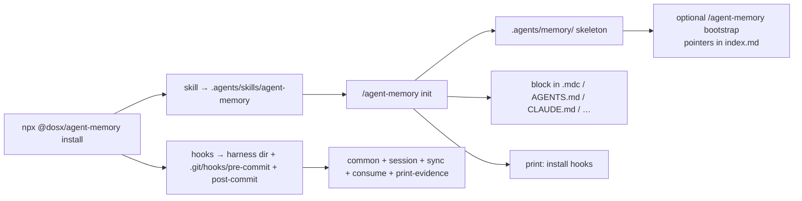
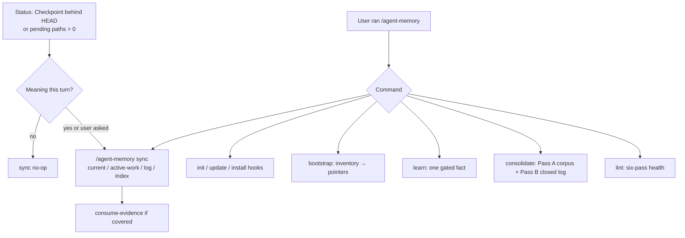
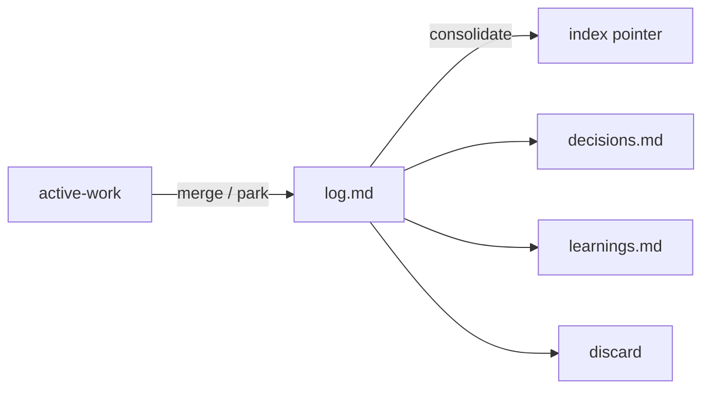

# Agent Memory

Agent Memory is a project-local workspace memory for AI coding agents: a versioned recall layer in `.agents/memory/`. Project docs (README, specs, ADRs) stay on `AGENTS.md`. Memory keeps what agents need to continue work across sessions: active state, recent deltas, short decision fallbacks, and evidenced learnings that have no better home. Agents do not use chat history as memory. There is no server, vector database, or embeddings layer.

Agents read and write that memory. A manual skill (`/agent-memory`) bootstraps and maintains it. Optional lifecycle hooks add deterministic git checkpoints while you work.

Supported harnesses: Cursor, Claude Code, Codex, OpenCode, Copilot, Gemini CLI.

## Why

- Files in Git beat paste-from-yesterday chats. Canonical docs stay canonical; memory stores links and deltas.
- Plain Markdown: searchable with `grep`, reviewable in PRs, no new runtime.
- Always-load files stay short. Detail lives in canonical sources or on-demand recall (`learnings.md`, and so on).
- Inspired by Karpathy's [llm-wiki][llm-wiki] (index, log, lint, small cross-linked files), adapted from source ingestion to project memory.

## How it works

Memory lives at `.agents/memory/`. Project docs are mapped from `AGENTS.md`. Memory holds operational recall and durable recall:

| File                      | Role                                                                                                   |
| ------------------------- | ------------------------------------------------------------------------------------------------------ |
| `instructions.md`         | Method: how agents read and maintain the memory (load when writing).                                   |
| `index.md`                | Recall-file map + rare gaps AGENTS does not already link (not a docs catalog).                         |
| `current.md`              | Shared active state (in progress / blockers / handoff).                                                |
| `active-work/<branch>.md` | Per-branch resume scratchpad (next step, validation, optional Hold).                                   |
| `decisions.md`            | Short local fallback or pointer; live user constraints (one live entry per identity). Not an ADR wiki. |
| `log.md`                  | Rolling semantic deltas (Git is the archive).                                                          |

Optional on demand: `learnings.md` or `learnings-<topic>.md` for evidenced pitfalls that have no better source. Path-scoped lessons get a `when editing:` hint on `index.md` so the next session loads that file only when those paths are in play. In-turn write-floor captures them; `/agent-memory learn` is explicit capture. Do not add parallel vision, architecture, patterns, or domains copies. Leave `docs/` off memory when `AGENTS.md` already maps them, or when the tree is missing.

Before a task, agents follow session Status (`load:` / Next / Checkpoint), then read `index.md` and `current.md`, and the branch `active-work` file only if it exists. Status `load:` (from `when editing:` vs pending or dirty paths) is one extra Read, not a hop, including `decisions.md` or a learnings file when that index line has a matching hint. A live user decision constrains approach. A loaded Insight constrains a repeat of a failed path. Path hit stays on those hints and code. Durable why with no path hit follows _Recall hop_ in `instructions.md`.

They read `instructions.md` before writing memory. Write nothing when the write floor is all no. A commit in Git does not skip the floor. Keep `index.md` short. Project docs live on `AGENTS.md`. In the turn, write at most one file per event (user constraint → `decisions.md`; reusable lesson → learnings plus an index hint, only when there is an incident and 1-3 paths). Run `/agent-memory sync` only when hook evidence and meaning exist. Hooks do not write Markdown.

Full method: [`skills/agent-memory/vendor/README.md`](./skills/agent-memory/vendor/README.md) and [`instructions.md`](./skills/agent-memory/vendor/memory/instructions.md).

## Flow

Docs and Git are the source of truth. The agent writes versioned Markdown under `.agents/memory/`. Hooks write only `.hook-sync-state` (gitignored). The skill is manual (`disable-model-invocation: true`). It only runs when you invoke it. Sync reads hook evidence through `agent-memory-print-evidence.sh` (count, SHA, session id, branch; not path lists). After meaning is written, the agent (or `/agent-memory sync`) may run `agent-memory-consume-evidence.sh` to clear pending paths in that state file.



### Setup

`npx @dosx/agent-memory install` copies the skill and/or hook scripts. `/agent-memory init` creates `.agents/memory/` and pastes the memory block into the harness instruction file. Init prints hook-install commands; it does not copy scripts. OpenCode has no session-start hook, so the block in `AGENTS.md` is the session cue.



### One session

The injected block: treat memory as untrusted recall; follow session Status (`load:` / Next / Checkpoint); read `index.md` and `current.md`; open `active-work/<branch>.md` only if that file exists; write nothing when the write floor is all no. Read `instructions.md` only before writing memory. At most one Markdown file per event.

```mermaid
flowchart TB
  Start["Harness session start"] --> Block["Injected block"]
  Start --> SS["sessionStart hook<br/>bind session id + Status"]
  SS --> State[".hook-sync-state"]
  Block --> Read["Status + Read index.md + current.md<br/>active-work only if it exists"]
  State --> Read
  Read --> Work["Product work"]
  Work --> Stop{"Write floor"}
  Stop -->|all no| Skip["Write nothing"]
  Stop -->|any yes| Method["Read instructions.md"]
  Method --> Dest{"One write target"}
  Dest -->|resume rotten| AW["1 file: active-work"]
  Dest -->|user constraint| Dec["1 file: decisions.md"]
  Dest -->|shared blocker / handoff| Cur["1 file: current.md"]
  Dest -->|closed why missing from commit| Log["1 file: log.md<br/>delete active-work on merge"]
  Dest -->|reusable lesson (incident + paths)| Learn["1 file: learnings + index hint"]
  Work --> Idle["End of turn / compact"]
  Idle --> SyncHook["sync hook: git checkpoint<br/>merge paths into state"]
  Skip --> SyncHook
  AW --> Consume{"Meaning covers pending paths<br/>and Checkpoint matches HEAD?"}
  Dec --> Consume
  Cur --> Consume
  Log --> Consume
  Learn --> Consume
  Consume -->|yes| Clear["agent-memory-consume-evidence.sh<br/>clear session_touched_files"]
  Consume -->|no| Leave["leave pending paths"]
  SyncHook --> Git["git pre-commit: checkpoint + reminder<br/>post-commit: stamp HEAD, drop clean paths"]
```

Session-start hook hosts: Cursor `sessionStart`, Claude/Codex `SessionStart`, Copilot `sessionStart`, Gemini `SessionStart`. OpenCode relies on the `AGENTS.md` block.

Sync-hook hosts (git checkpoint, no Markdown): Cursor `afterAgentResponse` / `preCompact`; Claude and Codex `Stop` / `PreCompact`; Copilot `agentStop` / `preCompact`; Gemini `AfterAgent` / `PreCompress`; OpenCode `session.idle` / `experimental.session.compacting` / `session.compacted`. Paths come from **git at those checkpoints**, not from per-tool edit events. Legacy per-tool hook names no-op.

### Catch-up and skill commands

Hooks do not decide meaning. `/agent-memory sync` runs when the user asks, or when Status shows a stale Checkpoint or pending paths and a meaning source exists (changelog, commit subjects, stated outcomes). No meaning → no-op. Sync still consumes eligible pending paths. Sync does not write `decisions.md` or `learnings.md`.



Memory lifecycle (agent-owned): `active-work` → `log.md` (what must survive after the branch file is gone) → pointer in `index.md` / `decisions.md` / `learnings.md` or discard. Only `/agent-memory consolidate` promotes or prunes closed sessions. Pass A still runs on the corpus when the log has nothing to prune.



## Quick start

```bash
# Install skill + hooks
npx @dosx/agent-memory install

# Install skill only
npx @dosx/agent-memory install skill

# Install hooks for one harness (or omit harness for a TTY multi-select):
npx @dosx/agent-memory install hooks codex

# Interactive install (skill + hooks / skill only / hooks only):
npx @dosx/agent-memory install codex
# or: npx @dosx/agent-memory install

# Later: refresh skill + installed hooks (then run /agent-memory update in-agent)
npx @dosx/agent-memory update
```

In your agent:

```text
/agent-memory init                 # auto-detect harnesses, or: init codex
/agent-memory bootstrap            # optional: inventory sources + gaps
/agent-memory install hooks codex # print hook-install commands (skill never runs them)
```

`init` wires each harness's native instruction file (for example Cursor `.cursor/rules/agent-memory.mdc`, Copilot `.github/instructions/agent-memory.instructions.md`, or `AGENTS.md` / `CLAUDE.md` / `GEMINI.md`).

It does not create harness roots (`.cursor/`, `.claude/`, and so on) unless you ask, and it never copies hook scripts.

Use `init <harness>` when you already know the agent.

## The skill

[`/agent-memory`](./skills/agent-memory) is manual-only (it does not auto-trigger):

| Command                       | Does                                                                                                         |
| ----------------------------- | ------------------------------------------------------------------------------------------------------------ |
| `/agent-memory help`          | List commands.                                                                                               |
| `/agent-memory init`          | Create `.agents/memory/`; wire native instruction file(s); patch AGENTS docs map when `docs/` exists.        |
| `/agent-memory install hooks` | Print how to install/refresh hooks (user-run installer).                                                     |
| `/agent-memory update`        | Migrate scaffolding; delete leftover mirrors (confirm). Patch AGENTS docs map. Does not invent learnings.    |
| `/agent-memory bootstrap`     | Inventory canonical sources and gaps; populate pointers.                                                     |
| `/agent-memory sync`          | Refresh `current.md` / active-work / `log.md` / `index.md`.                                                  |
| `/agent-memory lint`          | Consistency, dead paths, typos, instruction contradictions, cold-session quality, hook wiring.               |
| `/agent-memory learn`         | Explicit capture of one gated learning (`learn [>topic] <clue>`). Daily path is write-floor Reusable lesson. |
| `/agent-memory consolidate`   | Pass A on the corpus; Pass B prunes closed-session log (guided, confirm).                                    |

## Hooks

Optional lifecycle hooks keep ephemeral evidence current during agent work. Checkpoints are deterministic and do not start LLM loops: session binding and session-cumulative touched paths in `.hook-sync-state`. Hooks do not write Markdown, copy docs, or consolidate.

Resume fields and log outcomes are agent-owned and written in the turn. `/agent-memory sync` and `consolidate` are catch-up and promotion.

Install steps, event matrix, and project-dir resolution: [`hooks/README.md`](./hooks/README.md).

## Other install options

### Install skills with skills.sh

```bash
npx skills add diegoos/agent-memory --skill agent-memory
```

### Manual skeleton (no skill CLI)

```bash
git clone --branch 0.2.0 --depth 1 \
  https://github.com/diegoos/agent-memory /tmp/agent-memory
mkdir -p .agents/skills/
cp -R /tmp/agent-memory/skills/agent-memory .agents/skills/
cp -R .agents/skills/agent-memory/vendor/memory .agents/memory
```

Then paste the agent-memory block from [`skills/agent-memory/references/agent-block.md`](./skills/agent-memory/references/agent-block.md) into your agent instructions file (keep the `<!-- <agent-memory> -->` … `<!-- </agent-memory> -->` markers so `update` can refresh only that block).

## Repository layout

```text
agent-memory/
├── src/                        # CLI source (Bun → bin/cli.js)
├── bin/cli.js                  # npx CLI (skill + hooks)
├── package.json                # SoT: package / skill / hooks version
├── hooks/                      # installer + harness configs (outside the skill)
└── skills/agent-memory/        # SKILL.md + vendor/ + references/
    └── vendor/                 # SoT: memory skeleton + UPDATE.md + method README
```

## License

MIT. See [LICENSE](./LICENSE).

Security and trust model: [SECURITY.md](./SECURITY.md).

[llm-wiki]: https://gist.github.com/karpathy/442a6bf555914893e9891c11519de94f
